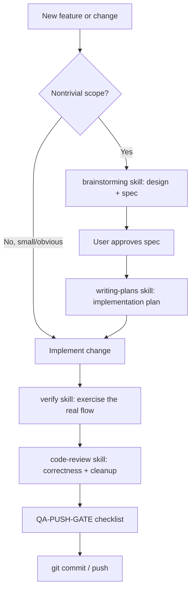

# Development Flow

The actual flow used on this repo — no multi-role consultation gates, since there's no
team to consult. Scales down to what a solo dev + AI assistant needs.

## Step-by-step

### 1. Decide if this needs a spec

Small, obvious, single-file changes: just implement. Anything touching data model,
multiple files, or a new feature area: run the `brainstorming` skill first — produces a
design doc under `docs/superpowers/specs/`, gets explicit approval before code.

### 2. Implement

Match existing conventions (see `docs/architecture/README.md`). Minimal, focused diff —
don't refactor unrelated code while implementing a feature.

### 3. Verify

Run the `verify` skill (or manually exercise the feature in a browser) before considering
it done. Typecheck/build passing is necessary, not sufficient — see the incident in
`docs/deployment/README.md` where a build succeeding said nothing about whether
production data actually existed.

### 4. Review

Run `code-review` on the diff before committing anything nontrivial.

### 5. Push

Complete `QA-PUSH-GATE.md` before `git push`.
